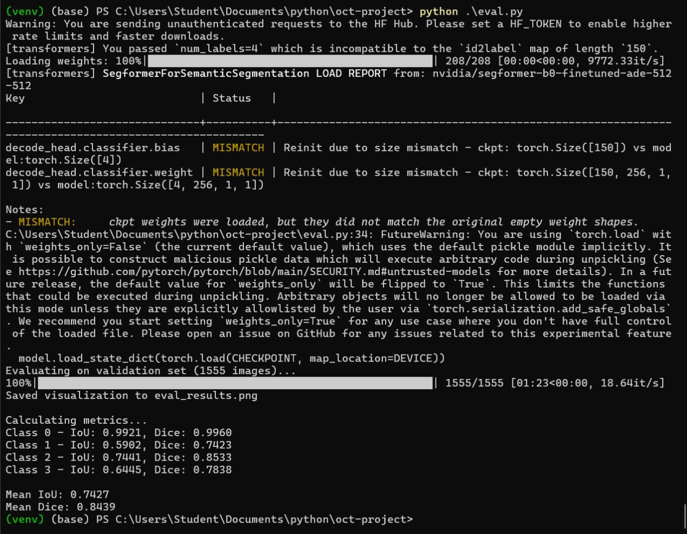
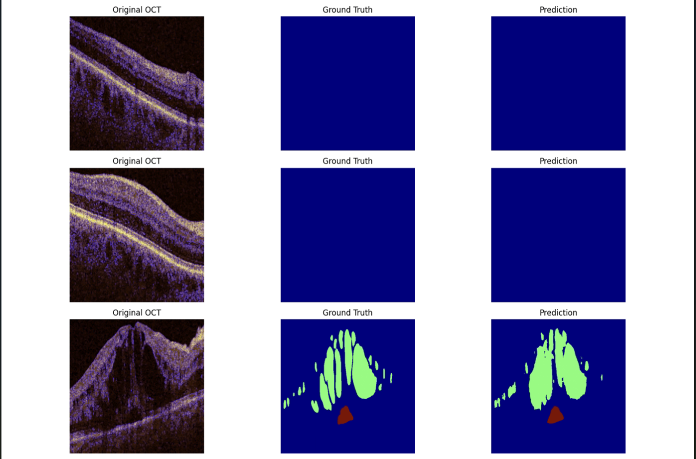

# Scans

<https://www.kaggle.com/datasets/saivikassingamsetty/retouch?resource=download-directory&select=retouch_processed>

## Project

Task: Neural net for OCT segmentation in DME diagnosis.

DME (Diabetic Macular Edema): Vision loss from retinal vessel damage.

IRF: Black spaces in retina, cysts. Intraretinal. Mostly Henle’s layer.
SRF: Black space between retina and RPE. Retinal detachment. Subretinal.
HRF: Small bright spots. All layers. Predict inflammation/lipids.

## Models

<https://github.com/qubvel-org/segmentation_models.pytorch>

CNN: UNet++, MA-Net
Transformers: DPT, SegFormer

Refs:

- Oktay (2018) Attention U-Net: <https://arxiv.org/abs/1804.03999>
- Zhou (2018) UNet++: <https://arxiv.org/abs/1807.10165>
- Lee (2022) MDPI Sensors: <https://www.mdpi.com/1424-8220/22/8/3055>
- Vaswani (2017) Attention: <https://arxiv.org/abs/1706.03762>
- Dosovitskiy (2020) ViT: <https://arxiv.org/abs/2010.11929>
- Xie (2021) SegFormer: <https://arxiv.org/abs/2105.15203>
- Tang (2022) SwinUNETR: <https://arxiv.org/abs/2201.01266>

## Methods

Hybrid Loss: $Loss = 0.5 \cdot DiceLoss + 0.5 \cdot FocalLoss$

Focal Loss: Handle imbalance. Focus on hard pixels. Weights: [1.0, 2.0, 1.0, 1.0] (higher for IRF).
Multi-modal Input: 3-channel stack (R: Original, G: Denoised, B: Edge).

Metrics:

- IoU (Jaccard): Pixel-sensitive overlap.
- Dice: Similarity coefficient.

## Results (50 Epochs)

Model: SegFormer-B0
Input: 512x512 (Multi-modal)

| Class | IoU | Dice |
|---|---|---|
| Background | 0.9921 | 0.9960 |
| IRF | 0.5902 | 0.7423 |
| SRF | 0.7441 | 0.8533 |
| HRF | 0.6445 | 0.7838 |
| **Mean** | **0.7427** | **0.8439** |

Findings:

1. SRF shows strongest segmentation quality.
2. IRF remains challenging but improved significantly with Focal Weight 2.0.
3. Multi-modal stack (denoised + edges) helps SegFormer localize fluid boundaries.

